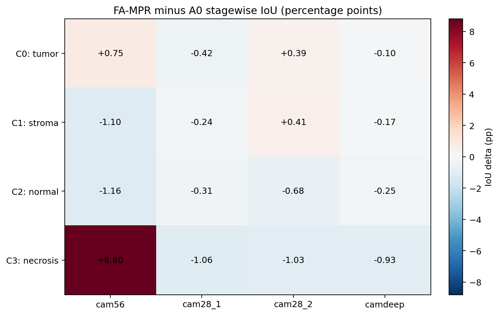

# FA-MPR BCSS Class-Response Diagnosis

## Executive conclusion

本轮严格冻结 A0 与 Full FA-MPR，不训练、不调参、不读取 test 做设计，仅在完整 BCSS validation（3418 张）执行相同的官方推理。最重要的结论是：**“FA-MPR 稳定提升 class 3”并不被 validation 支持。**此前 final-checkpoint test 上 class 3 IoU 为 `+0.9843 pp`，但 validation 上 class 3 为 `-1.1524 pp`，且四类 IoU 全部下降；整体 mIoU 从 `67.3102%` 降至 `66.8062%`（`-0.5040 pp`）。因此，test 上的 class-dependent redistribution 不能直接解释成稳定机制收益。

不过，validation 揭示了一个可重复的局部信号：FA-MPR 对 class 3 的 3-pixel boundary、small component 和 medium component 分别产生 `+1.4516`、`+4.3023` 和 `+1.6196 pp` 的净像素修正，但在 class 3 interior 和 large component 分别为 `-0.2301` 和 `-1.2457 pp`。CAM56 的 class 3 IoU 也提高 `+8.8015 pp`，而实际官方融合所用的 CAM28_1、CAM28_2、CAMdeep 分别下降 `-1.0625`、`-1.0283`、`-0.9307 pp`。这说明浅层碎片/边界形态信号确实存在，但既没有稳定传播到最终融合，也会在大区域和内部产生代价。

机制上，frequency-to-dilation 映射确实按设计工作：各 stage/class 的 `corr(M,D)` 为 `-0.9995` 至 `-0.9998`，`corr(M, raw HF ratio)` 为 `0.9733` 至 `0.9902`。问题不在于映射没有执行，而在于它不能可靠区分“应保留的形态变化”和“会导致错误的高频变化”。Corrected 与 harmed 像素间的方向随 class 和 stage 翻转，关键变量的标准化效应大多只有 small-to-moderate（本报告观察到的最大绝对 Cohen's d 为 `0.369`），没有统一的 morphology threshold 能分开两组。

另一个重要工程发现是，官方 BF16 forward 下 frequency band weights 在空间上退化为常数，AdaKern 的 `g_high` 完全为 1，`g_low` 的通道标准差仅约 `0.00069/0.00174/0.00094`；同时学习后的 3×3 base kernel 平均通道和约为 `0.471/0.470/0.466`，远离初始化的 unit-sum 1。`Y_FA` 相对 CH 的差异很大（class-conditioned `R_FA` 约 `0.66–0.82`），全局 scalar anchor 仍将约 `0.24–0.28` 的相对残差注入 HFRM。现有证据因此更支持：**frequency 提供“哪里变化”的弱线索，但需要 semantic context 决定该变化应被保留还是均质化；同时 adaptive-kernel 的幅值保持也应成为下一版的硬约束。**这是下一步假设，不是已经证明的因果结论。本轮未实现下一架构。

## 1. Frozen scope and provenance

| Item | Frozen value |
|---|---|
| Dataset | BCSS validation only, 3418 images |
| A0 checkpoint | `/home/duyanhong/sshr-official-25ep-final-retry2-20260815/runs/bcss_seed42/checkpoints/stage1_last.pth` |
| A0 SHA256 | `509c264ec2df3b7dd6628b227d088db48300a2bc101ef3496d34ea6525911579` |
| FA-MPR checkpoint | `/home/duyanhong/fampr-bcss-seed42-25ep-final-20260816/checkpoints/stage1_last.pth` |
| FA-MPR SHA256 | `6dac360ddf5fe883b01dc5ac0a77dbdd84ea57067ac393439b24de20a4f7b1d7` |
| FA-MPR source commit | `e4b7b6cb0d9354afc07f9d0348f801340043ffd1` |
| Preprocessing | resize 224, ImageNet normalization |
| Evaluation dtype | BF16 autocast, matching the frozen command |
| TTA | original + horizontal flip + vertical flip |
| BCSS presence thresholds | class 0–3: `0.8/0.9/0.8/0.6` |
| Final CAM fusion | `0×CAM56 + 0.6×CAM28_1 + 0.2×CAM28_2 + 0.2×CAMdeep` |
| Metric | released `iouutils` convention, including GT-background overwrite |
| Boundary | fixed disk radius 3 px around a GT class transition |
| Component bins | per-class validation q25/q75 of 8-connected GT component area |

两模型均为 `eval()`、所有参数 `requires_grad=False`，脚本不创建 optimizer，也不调用 `train()`。分析 wrapper 与官方接口在真实输入上的五个输出（四级 CAM 与 classification probability）最大绝对误差全部为 `0.0`，即 `forward_with_diagnostics == forward_cam`。本轮没有运行 test；开头引用的 test 数值仅是实验背景，不参与任何选择或结论阈值。

## 2. Validation endpoint

| Metric | A0 | FA-MPR | Delta (pp) |
|---|---:|---:|---:|
| mIoU | 67.3102 | 66.8062 | -0.5040 |
| mDice | 80.2563 | 79.8850 | -0.3713 |
| class 0 IoU (tumor) | 76.4038 | 76.0622 | -0.3416 |
| class 1 IoU (stroma) | 70.5463 | 70.4355 | -0.1108 |
| class 2 IoU (normal) | 57.8268 | 57.4155 | -0.4112 |
| class 3 IoU (necrosis) | 64.4640 | 63.3116 | -1.1524 |

这与 test 上 `mIoU +0.0596 pp`、class 3 `+0.9843 pp` 的方向不一致。可证明的是效应跨 split 不稳定；仅凭两个 split 不能区分它来自样本组成、final-checkpoint 波动还是独立训练的随机性。

## 3. Pixel and confusion transitions

GT background 不参与下表，因为官方 metric 在 background 上强制覆写 prediction。对四个前景类，四个 correctness group 互斥且完备。

| GT class | Corrected rate | Harmed rate | Net correction rate |
|---|---:|---:|---:|
| 0 tumor | 1.1682% | 1.8751% | -0.7069 pp |
| 1 stroma | 1.6359% | 1.3907% | +0.2453 pp |
| 2 normal | 1.8714% | 2.1428% | -0.2715 pp |
| 3 necrosis | 2.0086% | 2.1772% | -0.1686 pp |

主要转移如下。

- **Class 0 的主要损失是 tumor → stroma。**在 GT class 0 中，A0 正确 class 0、FA-MPR 改成 class 1 的像素为 1,005,452（占该类 1.6274%）；反向由 A0 class 1 修正回 class 0 的像素为 674,044（1.0910%）。最终 class 0 TP 减少 436,742。
- **Class 1 的 recall 实际提高，但 IoU 仍下降。**Class 1 TP 增加 163,968，净像素修正为 `+0.2453 pp`；然而预测为 class 1 的前景 false positive 增加 359,186，其中来自 GT class 0 的增加为 306,550。因此 precision 从 `80.7270%` 降至 `80.3620%`，抵消了 recall 增益。
- **Class 2 主要在 class 1 之间重新分配。**A0 正确 class 2 → FA-MPR class 1 为 430,742，而 A0 class 1 → FA-MPR 正确 class 2 为 356,846，TP 减少 56,219。
- **Class 3 同时出现恢复与破坏。**A0 class 0 → 正确 class 3 为 121,909，但正确 class 3 → class 0/class 1 分别为 99,580/89,220。Class 3 TP 减少 15,685，同时 class 3 false positive 增加 166,721，后者是 IoU 降幅大于 recall 降幅的主要原因。

完整 4×4、按 GT class 分层的 A0→FA-MPR transition matrix 在 [prediction transition table](../audit/fampr_pixel_transition_stats.csv) 和 [heatmap](../audit/fampr_visualizations/prediction_transition_by_gt_class.png) 中。

## 4. Class-conditioned FA-MPR behavior

三个 stage 的 class-conditioned 均值范围如下。

| Stage | M | D | Raw HF ratio | R_FA | R_MPR |
|---|---:|---:|---:|---:|---:|
| stage 1 / CAM56 | 0.381–0.414 | 4.517–4.715 | 0.404–0.437 | 0.746–0.807 | 0.255–0.276 |
| stage 2 / CAM28_1 | 0.339–0.365 | 4.808–4.966 | 0.372–0.400 | 0.747–0.816 | 0.243–0.265 |
| stage 3 / CAM28_2 | 0.220–0.233 | 5.604–5.680 | 0.245–0.258 | 0.661–0.715 | 0.243–0.262 |

### 4.1 Frequency and dilation

`M` 与未加权 raw HF ratio 高度相关（`r=0.9733–0.9902`），而 `D` 与 `M` 几乎严格反相关（`r=-0.9995–-0.9998`）。因此问题不是“高频没有触发小 dilation”；这条路径工作得近似确定性。值得注意的是 stage 3 的 M 显著低于前两级，所以它普遍选择更大 dilation。

### 4.2 Frequency selector and AdaKern collapse under frozen BF16 inference

官方 BF16 forward 下，四个 band weights 在空间和样本间没有可分辨变化：

| Stage | band 0 | band 1 | band 2 | band 3 |
|---|---:|---:|---:|---:|
| stage 1 | 1.0000 | 1.0000 | 1.0000 | 1.1250 |
| stage 2 | 0.9922 | 1.0078 | 1.0000 | 1.2109 |
| stage 3 | 1.0000 | 0.9922 | 1.0000 | 1.2031 |

Checkpoint 中 band predictor 权重并非零（三级末层 weight L2 分别为 `0.0152/0.0269/0.0306`），所以准确表述是：**学到的输出变化在该 checkpoint 的 BF16 inference scale 上被常数 bias/量化主导**，而不是参数没有训练。

AdaKern 同样接近 neutral：`g_low=g_high=1.0`；`g_high` 通道标准差为 0，`g_low` 通道标准差仅约 `0.00069/0.00174/0.00094`。另一方面，学习后的 base kernel 全为正，但平均通道和约为 `0.471/0.470/0.466`，而 Gaussian 初始化的通道和为 1。这表示 gates 几乎不提供自适应补偿，而 kernel 自身不再保持常数信号幅值。

### 4.3 CH anchor

FP32 checkpoint 中三个 anchor lambda 为 `0.3423/0.3253/0.3671`，gamma_context 为 `1.1984/1.5882/1.1944`。由于 `Y_MPR = Y_CH + lambda(Y_FA-Y_CH)`，`R_MPR` 是 `R_FA` 的全局 scalar 缩放；它不是按语义类别或像素选择的 blend。`R_FA≈0.66–0.82` 已相当大，即使 anchor 仅约 0.33，仍留下 `R_MPR≈0.24–0.28` 的普遍偏移。

## 5. Corrected versus harmed pixels

关键变量没有跨 class/stage 一致的 corrected signature。以 class 3 为例：

| Stage | Cohen d: M | Cohen d: D | Cohen d: HF | Cohen d: R_MPR |
|---|---:|---:|---:|---:|
| stage 1 | -0.242 | +0.242 | -0.237 | +0.127 |
| stage 2 | -0.016 | +0.014 | -0.044 | -0.284 |
| stage 3 | +0.216 | -0.216 | +0.171 | -0.369 |

这里 Cohen's d 定义为 corrected minus harmed。Stage 1 中被修正的 class 3 像素反而具有更低 M/HF 和更大 D；到 stage 3 才变成更高 M/HF 和更小 D。R_MPR 又呈不同方向。这种 stage-dependent sign reversal 不支持一个统一的“高 M 就会修正 class 3”规则。

Class 0 在 stage 1 的 M/HF 差异近乎可忽略（`d≈+0.06/+0.05`），而在 stage 2/3，corrected 像素的 R_MPR 小于 harmed（`d=-0.207/-0.140`）。Class 1 的 corrected 像素在三个 stage 都具有更低 HF（`d=-0.299/-0.110/-0.185`），却有略大的 R_MPR（`d=+0.164/+0.142/+0.173`）。这进一步说明 adaptive residual 的大小与 morphology cue 没有形成稳定的语义决策关系。

Welch 与 Mann–Whitney 检验仅作为 exploratory 输出。由于像素存在强空间相关、样本 reservoir 是近似抽样且 n 极大，极小 p-value 不能被解释成独立生物学证据；本报告以 effect size、方向稳定性和分层性能为主。完整数据见 [corrected versus harmed statistics](../audit/fampr_corrected_vs_harmed_stats.csv)。

## 6. Boundary, interior, and component size

| GT class | Boundary net | Interior net |
|---|---:|---:|
| 0 tumor | -1.8619 pp | -0.6671 pp |
| 1 stroma | +1.1892 pp | +0.1834 pp |
| 2 normal | -0.2581 pp | -0.2724 pp |
| 3 necrosis | +1.4516 pp | -0.2301 pp |

FA-MPR **不是普遍改善 boundary**：它改善 class 1/3 boundary，却显著伤害 class 0 boundary。Class 3 的局部收益集中在 boundary；整体下降来自更大的 interior 体量以及 false positive。

各类 component 阈值没有人工搜索：tumor q25/q75=`2017/43264.5`，stroma=`188/22440`，normal=`766.5/18666`，necrosis=`1935/37235` pixels。

| GT class | Small net | Medium net | Large net |
|---|---:|---:|---:|
| 0 tumor | +2.9819 pp | -0.9607 pp | -0.5718 pp |
| 1 stroma | +1.1066 pp | +0.8063 pp | +0.0980 pp |
| 2 normal | +0.9054 pp | +0.3034 pp | -0.4643 pp |
| 3 necrosis | +4.3023 pp | +1.6196 pp | -1.2457 pp |

这里是 GT component 内的 pixel recall/net correction，不是 region IoU。结果支持 FA-MPR 偏向恢复 small/fragmented regions，尤其 class 3；但这种局部优势以 large-region 稳定性为代价。见 [component-size figure](../audit/fampr_visualizations/component_size_net_correction.png)。

## 7. Stage-wise CAM evidence

| Stage | ΔmIoU | C0 ΔIoU | C1 ΔIoU | C2 ΔIoU | C3 ΔIoU |
|---|---:|---:|---:|---:|---:|
| CAM56 | +1.8233 | +0.7485 | -1.1008 | -1.1559 | **+8.8015** |
| CAM28_1 | -0.5082 | -0.4210 | -0.2421 | -0.3072 | -1.0625 |
| CAM28_2 | -0.2258 | +0.3876 | +0.4143 | -0.6771 | -1.0283 |
| CAMdeep | -0.3625 | -0.0998 | -0.1700 | -0.2494 | -0.9307 |

Class 3 的增益首先出现在最浅 CAM56，但官方 fusion 给 CAM56 的权重为 0。CAM28_1 是最终融合的主项，却对四类都下降；这比“最终 fusion 恰好不佳”更像是浅层有用信号未被稳定传递。CAMdeep 架构上不经过 FA-MPR contextual path，但两个 checkpoint 是独立训练得到的，所以 deep CAM 不要求数值相同；其差异不能解释成 FA-MPR 对 deep head 的直接结构作用。



## 8. Automatically selected visual evidence

样本完全按全图 corrected minus harmed pixels 自动排序，不人工挑图。四个 Top-10 排名及每图各类计数见 [selection table](../audit/fampr_visualization_selection.csv)，所有去重个案图位于 `audit/fampr_visualizations/selected_cases/`。每张图包括 input、GT、A0/FA-MPR prediction、corrected/harmed mask，以及三级 M、D、HF、R_FA、R_MPR 和 CAM difference。

代表性的自动 [Top-1 改善样本](../audit/fampr_visualizations/selected_cases/TCGA-LL-A740-DX1_xmin39436_ymin24080_MPP-0.2500+83.png) 是纯 stroma patch，FA-MPR 清除了 A0 的大片 tumor false positive；[Top-1 失败样本](../audit/fampr_visualizations/selected_cases/TCGA-EW-A1PH-DX1_xmin3455_ymin52049_MPP-0.2500+158.png) 主要是 necrosis，被 FA-MPR 大面积推向 tumor。这两类图共同显示同一种 morphology response 可以产生方向相反的语义结果，不能只展示成功案例。

## 9. Answers to the six scientific questions

### Q1. Why did FA-MPR mainly improve class 3?

严格答案是：**它没有在 validation 上整体提升 class 3，因此不存在跨 split 稳定的“mainly improves class 3”效应。**可支持的局部解释是，class 3 的碎片/边界形态与浅层高分辨率表征受益：boundary `+1.4516 pp`、small component `+4.3023 pp`、CAM56 `+8.8015 IoU pp`。Test 的 `+0.9843 pp` 与这一局部机制相容，但本轮不能用 validation 证据追溯 test 的精确来源。

### Q2. Why did classes 0 and 1 decline?

Class 0 是明显的 tumor→stroma 过度转移，TP 减少 436,742，且 boundary 损失尤其大。Class 1 自身 recall 反而改善，但来自其他类、尤其 class 0 的 stroma false positive 增加，使 precision 与 IoU 下降。因此二者不是同一种失败：class 0 主要丢 recall，class 1 主要丢 precision。

### Q3. Does high frequency really produce smaller dilation?

是，且几乎是确定性关系：M 与 raw HF ratio 强正相关，M 与 D 几乎严格负相关。该结果证明 mapping 被执行，不证明这种 mapping 在语义上正确。

### Q4. How does adaptive behavior differ between corrected and harmed pixels?

没有统一方向。Class/stage 间 M、D、HF 与 R_MPR 的 corrected-minus-harmed 符号多次翻转；class 3 从 stage 1 的“corrected 更低频/更大 dilation”变为 stage 3 的“corrected 更高频/更小 dilation”。因此 morphology cue 单独不足以作为是否保留结构的判据。

### Q5. Which failure hypothesis is best supported?

证据排序为：

1. **B + A：morphology/frequency cue 有局部价值，但缺少 semantic condition。**这是 boundary/small-component/CAM56 收益与 class-dependent sign reversal 共同支持的主结论。
2. **E：CH blending 缺少选择性。**Lambda 是每 stage 一个全局 scalar，R_MPR 普遍约 0.24–0.28，无法针对不同组织或 corrected/harmed pixel 调节。
3. **D：AdaKern 存在幅值/有效自适应不足的工程风险。**Gates 在 BF16 下近乎 neutral，base kernel 不保持 unit sum。它是强诊断信号，但没有组件因果对照，不能断言它单独造成性能下降。
4. **C：dilation range 本身有问题，证据不足。**映射工作正常，本轮没有合法的 frozen counterfactual 去判定 `[1,7]` 是否错误。

### Q6. Is “frequency locates change, semantics decides preserve vs homogenize” supported?

**作为下一步假设，得到中等强度支持；作为已证实结论，尚不成立。**支持来自局部形态收益与跨语义失败的并存，以及 corrected/harmed 无统一 frequency signature。要证明它，需要未来预注册的 semantic-conditioned 对照实验；本轮没有、也不应实现或训练该模块。

## 10. Evidence, interpretation, and next hypothesis

### Evidence

- 完整 validation 上四类 IoU 全降，class 3 test 增益不跨 split 稳定。
- Class 3 boundary/small component 与 CAM56 有显著局部收益，大区域/内部及最终使用的 CAM stages 退化。
- Frequency→morphology→dilation 链路数值上正常，但 corrected/harmed 的方向不稳定。
- BF16 下 band selector 输出近常数，AdaKern gates 近 neutral，base kernel 的通道和约 0.47。
- Global scalar anchor 将一个幅值很大的 adaptive-vs-CH residual 无差别混合到所有组织。

### Interpretation

FA-MPR 更像一个有局部形态敏感性、但缺乏语义判别和幅值守恒的 correction generator。它能找回部分碎片/边界，却也会将 tumor 等高频形态推向 stroma/necrosis，并在大区域制造不稳定。

### What is supported

- 局部 fragmented morphology 信号是真实存在的。
- 当前 cue 不能单独决定 preserve/homogenize。
- Semantic conditioning 与 amplitude-preserving residual 是合理的下一研究方向。

### What is NOT supported

- FA-MPR 稳定提升 class 3。
- 某个单一 M/HF/dilation threshold 能区分 corrected 与 harmed。
- 仅靠当前观察就能断言 dilation range、AdaKern 或 lambda 是唯一原因。
- 用 test 上的 class 3 增益选择新结构。

### Recommended next architectural hypothesis

下一版应检验一个**semantic-conditioned、identity-centered、amplitude-preserving morphology residual**：frequency 只提出“可能发生形态变化的位置”，深层语义决定 residual 的符号/强度；adaptive kernel 必须显式保持 DC/unit-sum 或采用零初始化残差参数化；blend 应从全局 scalar 改为有界的 semantic/spatial gate。该方案应先写冻结协议和单元/数值测试，再由 validation-only 选择是否值得正式训练。本报告不实现该架构。

## 11. Reproduction and limitations

运行入口：

```bash
python tools/analyze_fampr_class_response.py \
  --data-root /home/duyanhong/reseg-data/raw/BCSS-WSSS/val \
  --a0-checkpoint /home/duyanhong/sshr-official-25ep-final-retry2-20260815/runs/bcss_seed42/checkpoints/stage1_last.pth \
  --fampr-checkpoint /home/duyanhong/fampr-bcss-seed42-25ep-final-20260816/checkpoints/stage1_last.pth \
  --output-dir audit \
  --device cuda --amp-dtype bf16 --boundary-radius 3 --visual-top-k 10
```

机器可读主结果为 [summary JSON](../audit/fampr_class_response_summary.json)。均值、标准差、计数、min/max 为 streaming exact；分位数和秩检验来自确定性 sampled reservoir。Connected-component 分析按 pixel recall 汇总，不能替代 object-level detection 指标。所有 GT 仅用于离线 validation 分层，不进入模型推理。未运行 test、LUAD、新 seed 或任何训练。
