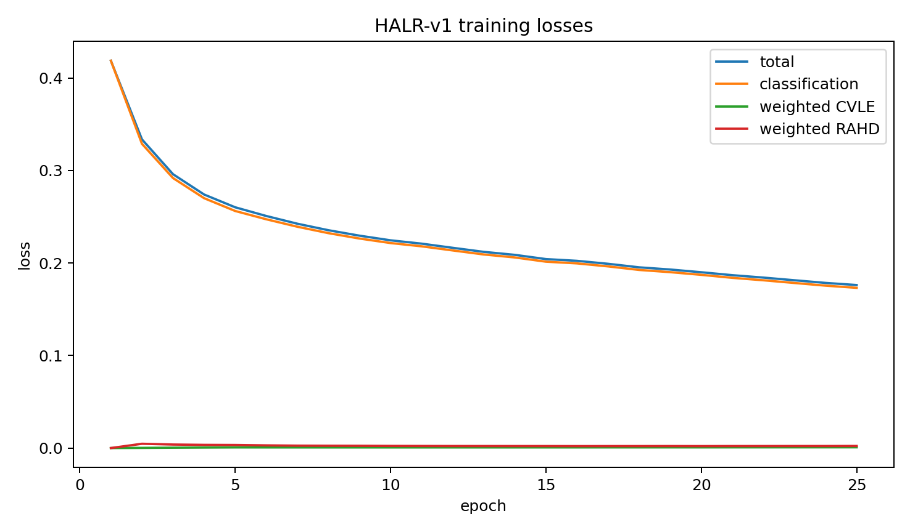
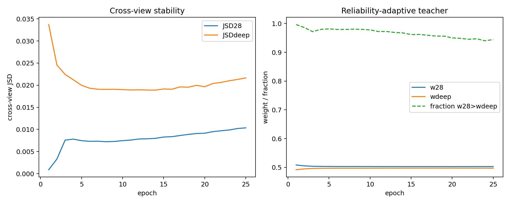

# HALR-v1 Full Model — BCSS Seed42 Epoch25 FINAL

## 1. Executive result

- Decision: **HALR_V1_NO_CLEAR_GAIN**
- ΔmIoU: **-0.4722 pp**
- ΔmDice: **-0.3466 pp**
- Epoch25 FINAL is the only primary checkpoint; no validation selection occurred.

## 2. Frozen experimental control

- Fresh ImageNet-pretrained clean official SSHR; no trained checkpoint was loaded.
- BCSS seed42, 25 epochs, effective base batch20, 224×224, BF16, released optimizer and augmentation.
- HALR adds zero model parameters and zero inference operations.
- CVLE and RAHD use only CAM28_1/CAMdeep plus image-level present labels during training.
- λCV=λHD=0.05 and the epoch1–5 ramp were frozen; no tuning occurred.

## 3. Epoch25 validation

| Model | Epoch | mIoU | mDice | C0 | C1 | C2 | C3 |
|---|---:|---:|---:|---:|---:|---:|---:|
| SSHR A0 | 25 | 67.3283 | 80.2683 | 76.4494 | 70.5721 | 57.8272 | 64.4646 |
| HALR-v1 | 25 | 66.8561 | 79.9216 | 76.1682 | 69.9360 | 57.1122 | 64.2081 |

| Quantity | Delta (pp) |
|---|---:|
| mIoU | -0.4722 |
| mDice | -0.3466 |
| C0 IoU | -0.2812 |
| C1 IoU | -0.6362 |
| C2 IoU | -0.7150 |
| C3 IoU | -0.2566 |

## 4. Teacher dynamics

| Epoch | JSD28 | JSDdeep | w28 | wdeep | w28>wdeep fraction |
|---:|---:|---:|---:|---:|---:|
| 5 | 0.00745877 | 0.01997877 | 0.50312987 | 0.49687016 | 0.98127425 |
| 10 | 0.00746424 | 0.01900785 | 0.50288579 | 0.49711424 | 0.97792726 |
| 15 | 0.00828030 | 0.01915164 | 0.50271773 | 0.49728230 | 0.96157775 |
| 20 | 0.00914101 | 0.01965256 | 0.50262778 | 0.49737225 | 0.95005411 |
| 25 | 0.01035618 | 0.02164277 | 0.50282151 | 0.49717852 | 0.94440588 |

## 5. Epoch25 mechanism diagnosis

- foreground: Deep 85.5114%, CAM28_1 85.8592%, Deep advantage -0.3478 pp.
- boundary: Deep 53.8009%, CAM28_1 53.6540%, Deep advantage +0.1469 pp.
- interior: Deep 85.9098%, CAM28_1 86.2638%, Deep advantage -0.3540 pp.
- Boundary definition: foreground pixels touching a different 4-neighbor label.
- GT masks were applied only after network forward and never entered training or inference decisions.

## 6. Runtime and resources

- SSHR / HALR parameters: 112,709,714 / 112,709,714
- Added parameters: 0
- Mean seconds/epoch: 220.29
- Peak training CUDA memory: 6.208 GiB
- A0 / HALR inference seconds per image: 0.013114 / 0.013530

## 7. Provenance

- Training source commit: `ed8c98e23c821a4b72b6a2627d6627720295054f`
- Evaluation source commit: `ed8c98e23c821a4b72b6a2627d6627720295054f`
- A0 checkpoint SHA256: `509c264ec2df3b7dd6628b227d088db48300a2bc101ef3496d34ea6525911579`
- HALR checkpoint SHA256: `0be9d31dfe9a6b1e31c606562132c10ba3f1f71dcecf1670d9e1aff62d53171f`
- Training config SHA256: `776305a374cf50f54d1831f5c0abdec9a9e370151867ae7925bd744d82bf28b1`
- Validation pairs: 3,418; BF16; official 3-way TTA, thresholds, class gate, min-max, 0/0.6/0.2/0.2 fusion and released metric.

## 8. Figures

## 9. Stop boundary

No test, LUAD, seeds 11/17, ablation, lambda/ramp sweep or HALR-v2 was run.

**HALR_V1_NO_CLEAR_GAIN**

STOP.
