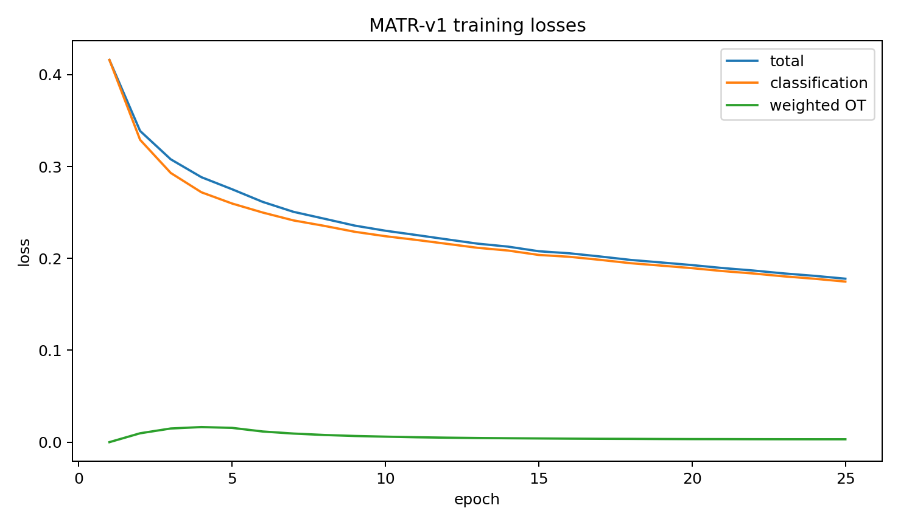
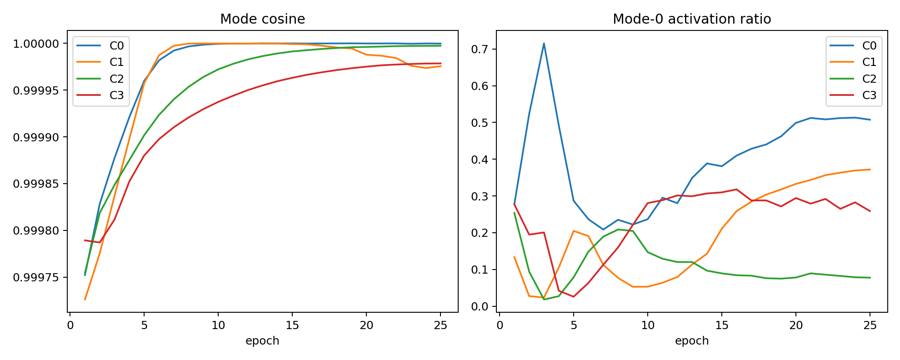
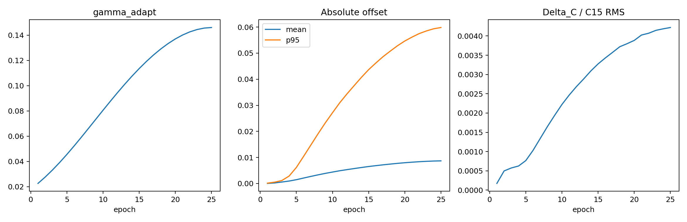

# MATR-v1 Full Model — BCSS Seed42 Epoch25 FINAL

## 1. Executive result

- Decision: **MATR_V1_NO_CLEAR_GAIN**
- Class safety: **MATR_CLASS_SAFETY_NOT_TRIGGERED**
- ΔmIoU: **-0.4003 pp**
- ΔmDice: **-0.2602 pp**
- Epoch25 FINAL is the only primary checkpoint; no validation selection occurred.

## 2. Frozen experimental control

- Fresh ImageNet-pretrained clean official SSHR; no trained checkpoint was loaded.
- BCSS seed42, 25 epochs, batch20, 224×224, BF16, released optimizer and augmentation.
- Only OT-MTR and SACR alter HFRM28_1/CAM28_1; all other SSHR branches and official inference are frozen.
- OT λ=0.05, two modes, epsilon=0.1, 20 Sinkhorn iterations and the epoch1–5 ramp were not tuned.

## 3. Epoch25 validation

| Model | Epoch | mIoU | mDice | C0 | C1 | C2 | C3 |
|---|---:|---:|---:|---:|---:|---:|---:|
| SSHR A0 | 25 | 67.3283 | 80.2683 | 76.4494 | 70.5721 | 57.8272 | 64.4646 |
| MATR-v1 | 25 | 66.9280 | 80.0081 | 75.4235 | 69.8522 | 58.0246 | 64.4118 |

| Quantity | Delta (pp) |
|---|---:|
| mIoU | -0.4003 |
| mDice | -0.2602 |
| C0 IoU | -1.0259 |
| C1 IoU | -0.7200 |
| C2 IoU | +0.1974 |
| C3 IoU | -0.0528 |

## 4. Standalone CAM28_1

| Model | CAM28_1 mIoU | CAM28_1 mDice |
|---|---:|---:|
| SSHR A0 | 67.0272 | 80.0458 |
| MATR-v1 | 64.4985 | 78.2574 |

## 5. OT-MTR mechanism

| Class | Mode cosine | Mode-0 activation | Mean seeds | Transport mass mode0/mode1 |
|---:|---:|---:|---:|---:|
| C0 | 0.99999976 | 0.50750240 | 108.2760 | 0.500000/0.500000 |
| C1 | 0.99997556 | 0.37192487 | 102.2892 | 0.500000/0.500000 |
| C2 | 0.99999738 | 0.07750265 | 86.4394 | 0.500000/0.500000 |
| C3 | 0.99997854 | 0.25879023 | 101.4544 | 0.500000/0.500000 |

- Epoch25 valid OT image-class pairs: 39922.
- Epoch25 raw/weighted OT loss: 0.06281539 / 0.00314077.

## 6. SACR mechanism

- gamma_adapt: 0.14600636
- Mean / p95 absolute offset: 0.00868436 / 0.05982851
- Mean modulation: 0.99858606
- Delta_C RMS / C15 RMS: 0.00173478 / 0.41207794
- Delta_C/C15 RMS: 0.00421843

## 7. Mechanistic interpretation

- The targeted CAM28_1 branch regressed from 67.0272 to 64.4985 mIoU
  (**-2.5286 pp**). The unchanged CAM28_2/deep branches and official fusion
  attenuated this damage, but the final fused prediction still lost 0.4003 pp.
- All four learned mode pairs ended almost collinear (cosine
  0.99997556–0.99999976). The exactly balanced 0.5/0.5 transport masses are
  imposed Sinkhorn marginals and therefore do not demonstrate semantic mode
  specialization. C2 also showed a strongly imbalanced mode-0 activation
  ratio of 0.0775.
- SACR's scale opened from its initial value, but the learned correction
  remained only 0.4218% of the original CH15 RMS. Mean and p95 offsets were
  only 0.0087 and 0.0598 feature pixels, while modulation stayed close to one.
  The adaptive context path therefore remained functionally conservative.
- C2 gained 0.1974 pp, but this was outweighed by C0 (-1.0259 pp), C1
  (-0.7200 pp) and C3 (-0.0528 pp). The class-safety flag is not triggered
  only because its preregistered prerequisite is an overall positive result.
- Taken together, the frozen run does not support the central MATR-v1 claim:
  OT-MTR did not produce distinct tissue modes, and SACR did not make a
  material correction to CH15.

## 8. Runtime and parameters

- SSHR / MATR parameters: 112,709,714 / 112,766,830
- Added parameters: 57,116 (0.050675%)
- Mean seconds/epoch: 355.64
- Peak training CUDA memory: 4.812 GiB
- A0 / MATR inference seconds per image: 0.023874 / 0.026791
- MATR inference was approximately 12.22% slower per image than A0. The mean
  training epoch time includes periods of GPU contention and is not treated as
  a clean architecture-only speed comparison.

## 9. Provenance

- Training source commit: `7aefd5a3a8535f7076f6c4b84488581d92017511`
- Evaluation source commit: `7aefd5a3a8535f7076f6c4b84488581d92017511`
- A0 checkpoint SHA256: `509c264ec2df3b7dd6628b227d088db48300a2bc101ef3496d34ea6525911579`
- MATR checkpoint SHA256: `50edaff87955f991a9ff0c1ada0cc4fd012f964c6914b2c4ba61f5886ca046fe`
- Training config SHA256: `5c4ddc54f269ef311ef70bcafff82f3301d6e694c2392a99ff7f76612ab32148`
- Validation pairs: 3,418; BF16; official 3-way TTA, thresholds, class gate, min-max, 0/0.6/0.2/0.2 fusion and released metric.

## 10. Figures

## 11. Stop boundary

No test, LUAD, seeds 11/17, ablation, mode/lambda/epsilon/offset sweep, diversity loss or MATR-v2 was run.

**MATR_V1_NO_CLEAR_GAIN**

STOP.
