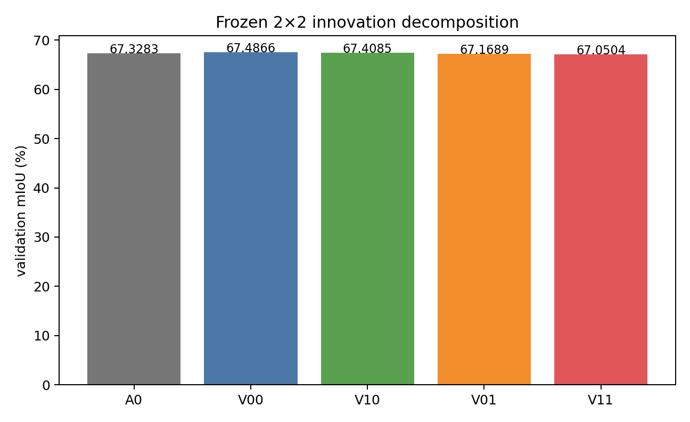
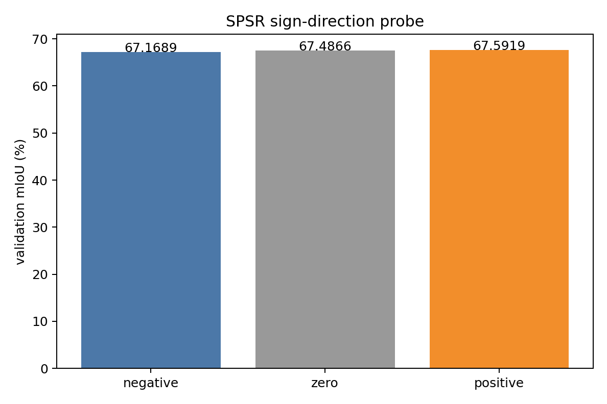
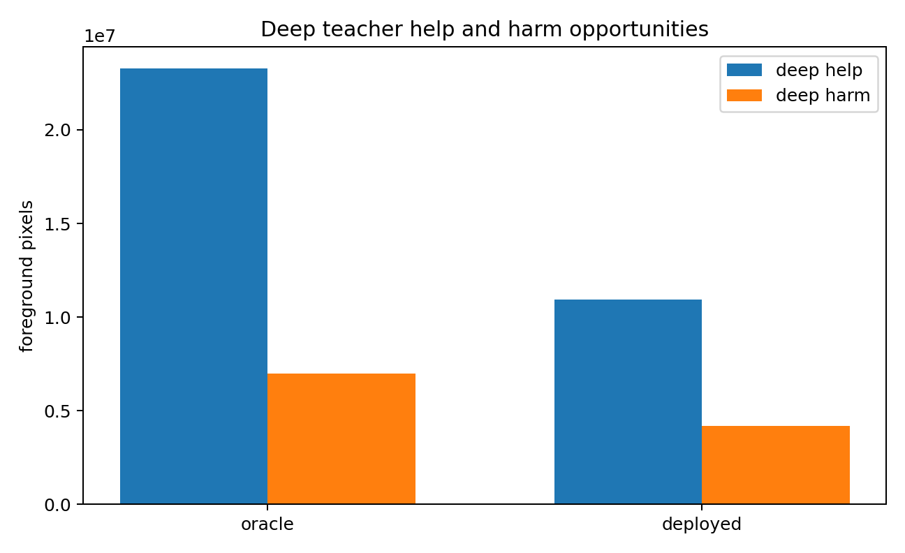
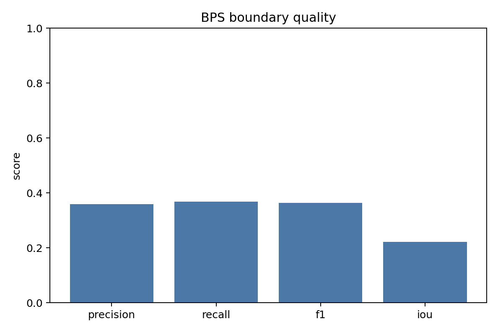
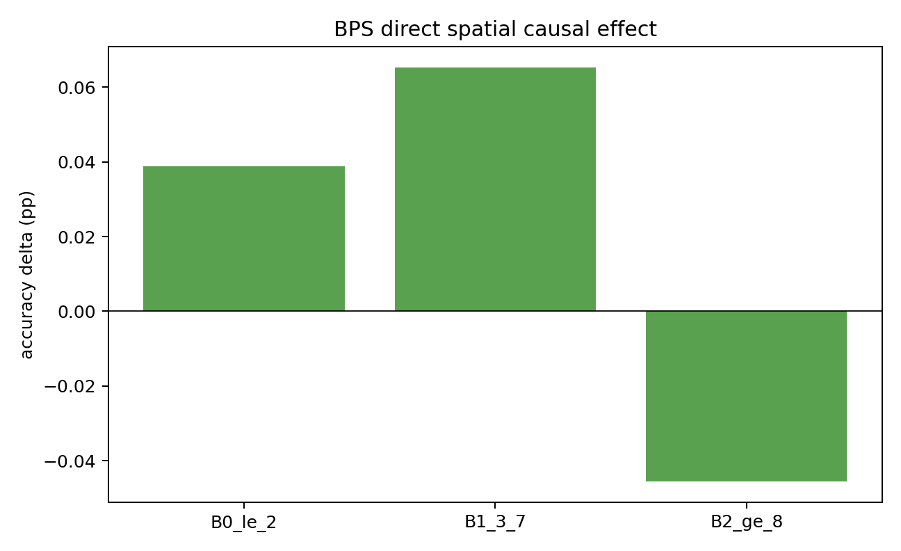
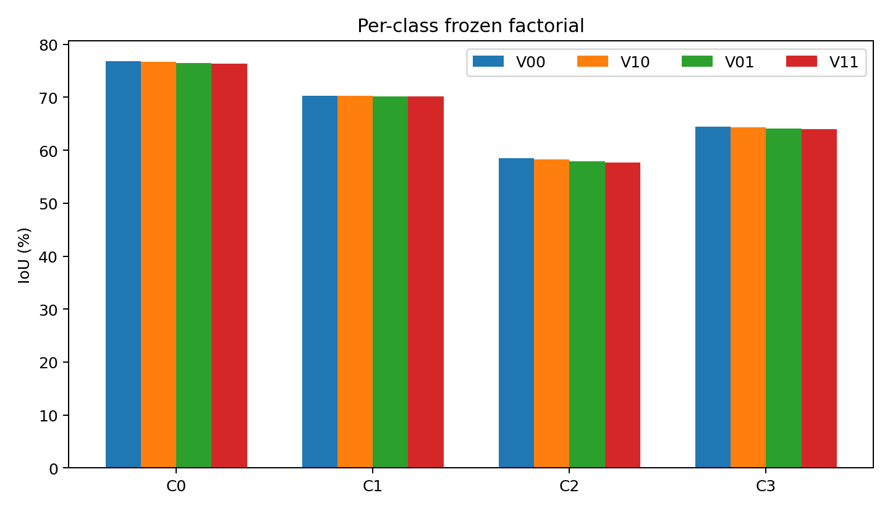

# S²HR-v1 FIDA-v0 — Frozen Innovation Decomposition Audit

## 1. Executive attribution

- Final route: **ROUTE D — CLOSE S²HR-v1 DUAL-INNOVATION DESIGN**
- Labels: BPS_DIRECT_HARMFUL, SPSR_DIRECT_HARMFUL, TRAINING_TRAJECTORY_POSITIVE, INNOVATION_INTERACTION_NEUTRAL, SPSR_DIRECTION_REJECTED
- Present-confusion teacher finding: **DEEP_PRESENT_CLASS_TEACHER_SUPPORTED**
- Frozen-checkpoint deployment effects do not establish fresh-training causality.
- No optimizer, update, retraining, test, LUAD, sweep or checkpoint mutation occurred.

## 2. Provenance and instrumentation parity

- Source commit: `c7ea4d5a058f5d872de4bcead81569ccd79a01a8`
- A0 checkpoint SHA256: `509c264ec2df3b7dd6628b227d088db48300a2bc101ef3496d34ea6525911579`
- S²HR checkpoint SHA256 before/after: `129ad097ad73f9f564d8778baa8e914f92c8200ed90dc1f8763677dffe91b9ac` / `129ad097ad73f9f564d8778baa8e914f92c8200ed90dc1f8763677dffe91b9ac`
- In-memory state_dict SHA256 before/after: `41aeb822dabec73d19895558cdfedb49d55e126c2573c6067b04fffd983d931b` / `41aeb822dabec73d19895558cdfedb49d55e126c2573c6067b04fffd983d931b`
- Frozen learned gamma_spatial / rho_boundary: `-1.05263877` / `0.12448688`
- Prior-run reference drift (A0 / V11): `+0.000000` / `+0.000420` pp (recorded only; not a selection or stopping rule)
- 32-image parity max CAM difference: `0.0`
- Parity differing final pixels: `0`
- Parity mIoU delta: `0.0`

## 3. Frozen 2×2 factorial

| Variant | mIoU | Δ vs V00 | mDice | C0 | C1 | C2 | C3 |
|---|---:|---:|---:|---:|---:|---:|---:|
| A0 | 67.3283 | -0.1582 | 80.2683 | 76.4494 | 70.5721 | 57.8272 | 64.4646 |
| V00 | 67.4866 | +0.0000 | 80.3903 | 76.8082 | 70.2441 | 58.4741 | 64.4198 |
| V10 | 67.4085 | -0.0781 | 80.3319 | 76.7365 | 70.2420 | 58.3056 | 64.3498 |
| V01 | 67.1689 | -0.3177 | 80.1566 | 76.4925 | 70.1449 | 57.9570 | 64.0811 |
| V11 | 67.0504 | -0.4362 | 80.0683 | 76.3750 | 70.1150 | 57.7210 | 63.9906 |

## 4. Factor effects

| Effect | ΔmIoU (pp) |
|---|---:|
| Training trajectory: V00 - A0 | +0.158231 |
| BPS given SPSR off | -0.078092 |
| BPS given SPSR on | -0.118488 |
| SPSR given BPS off | -0.317681 |
| SPSR given BPS on | -0.358078 |
| Interaction | -0.040397 |
| Full - V00 direct innovation effect | -0.436170 |
| Full - A0 total effect | -0.277939 |
| BPS main effect | -0.098290 |
| SPSR main effect | -0.337880 |
| Decomposition identity residual | +0.000000 |

## 5. SPSR sign-direction audit

| State | gamma | mIoU | Δ vs zero | Boundary Δacc | Interior Δacc |
|---|---:|---:|---:|---:|---:|
| Learned negative | -1.05263877 | 67.1689 | -0.3177 | +0.0049 | -0.1809 |
| Zero | +0.00000000 | 67.4866 | +0.0000 | +0.0000 | +0.0000 |
| Positive flip | +1.05263877 | 67.5919 | +0.1053 | -0.0717 | +0.0376 |

## 6. Deep spatial teacher reliability

| Presence | Region | Deep Acc | Raw28_1 Acc | Deep-help | Deep-harm | Net rate |
|---|---|---:|---:|---:|---:|---:|
| oracle | overall | 84.3152 | 74.0602 | 23,266,202 | 6,997,786 | +10.2550% |
| oracle | boundary | 52.9725 | 51.8341 | 2,099,777 | 1,952,851 | +1.1383% |
| oracle | interior | 87.0912 | 76.0288 | 21,166,425 | 5,044,935 | +11.0624% |
| deployed | overall | 82.0768 | 77.8150 | 10,931,954 | 4,171,071 | +4.2618% |
| deployed | boundary | 51.3361 | 50.7407 | 1,091,882 | 1,015,033 | +0.5954% |
| deployed | interior | 84.7994 | 80.2129 | 9,840,072 | 3,156,038 | +4.5865% |

## 7. BPS boundary quality and direct effect

| Metric | Result |
|---|---:|
| Boundary precision | 0.359493 |
| Boundary recall | 0.368400 |
| Boundary F1 | 0.363892 |
| Boundary IoU | 0.222413 |
| Predicted boundary fraction | 0.167989 |
| GT boundary fraction | 0.163927 |
| B2 interior contamination | 0.732087 |
| Outside-foreground fraction | 0.098762 |
| BPS overall ΔmIoU | -0.078092 pp |
| BPS boundary (B0+B1) net recovery | 7,056 |
| BPS B0 net recovery | 2,012 |
| BPS B2 net recovery | -66,455 |

The boundary-quality estimate pools the three actual unflipped 28×28 TTA controller maps. Teacher logits are TTA-averaged before the GT/deployed-presence diagnostic.

## 8. Counterfactual error taxonomy

| Variant | Absent error | Present confusion | Boundary error | Interior error |
|---|---:|---:|---:|---:|
| V00 | 3,983,975 | 23,069,362 | 6,252,805 | 20,800,532 |
| V10 | 4,004,379 | 23,108,357 | 6,245,749 | 20,866,987 |
| V01 | 3,981,498 | 23,334,840 | 6,252,172 | 21,064,166 |
| V11 | 4,005,763 | 23,412,314 | 6,244,654 | 21,173,423 |

Positive-sign SPSR residual utility: recovered=740,540, harmed=694,976, net=45,564; recovered-in-deep-help fraction=0.589672.

## 9. C1/C3 decomposition

| Class | Trajectory | BPS main | SPSR main | Interaction | Total |
|---|---:|---:|---:|---:|---:|
| C1 | -0.3280 | -0.0160 | -0.1131 | -0.0278 | -0.4571 |
| C3 | -0.0448 | -0.0802 | -0.3490 | -0.0204 | -0.4740 |

## 10. Required answers

1. V00-A0 is +0.1582 pp (TRAINING_TRAJECTORY_POSITIVE); this is the frozen joint-training trajectory effect.
2. BPS-only V10-V00 is -0.0781 pp (BPS_DIRECT_HARMFUL).
3. SPSR-only V01-V00 is -0.3177 pp (SPSR_DIRECT_HARMFUL).
4. The factorial interaction is -0.0404 pp (INNOVATION_INTERACTION_NEUTRAL).
5. Learned negative gamma is not better than zero by -0.3177 pp.
6. Positive sign flip is not worse; it is better than learned negative by +0.4230 pp, so the learned direction is rejected.
7. With GT-present classes, deep local accuracy is 84.3152% versus raw28_1 74.0602%; present-confusion error is 15.6848% versus 25.9398% (DEEP_PRESENT_CLASS_TEACHER_SUPPORTED).
8. Deep teacher opportunities are help=23,266,202, harm=6,997,786, net=16,268,416.
9. At GT boundary bins, deep accuracy is 52.9725% versus raw28_1 51.8341% (not worse).
10. BPS boundary precision/recall/F1 are 0.3595/0.3684/0.3639; B2 contamination is 73.21%.
11. BPS B0/B1/B2 net recoveries are 2,012/5,044/-66,455 pixels.
12. C1 decomposition is trajectory=-0.3280, BPS=-0.0160, SPSR=-0.1131, interaction=-0.0278 pp; C3 is trajectory=-0.0448, BPS=-0.0802, SPSR=-0.3490, interaction=-0.0204 pp.
13. The total -0.2779 pp splits into trajectory +0.1582 pp and direct deployment -0.4362 pp.
14. BPS-CH retention decision: BPS_DIRECT_HARMFUL.
15. SPSR decision: SPSR_DIRECT_HARMFUL; sign/teacher evidence labels are SPSR_DIRECT_HARMFUL, SPSR_DIRECTION_REJECTED.
16. The only selected next route is ROUTE D — CLOSE S²HR-v1 DUAL-INNOVATION DESIGN.

## 11. Figures

## 12. Stop boundary

No automatic retraining, redesign, other seed, LUAD, test or tuning was run.

**ROUTE D — CLOSE S²HR-v1 DUAL-INNOVATION DESIGN**

STOP.
