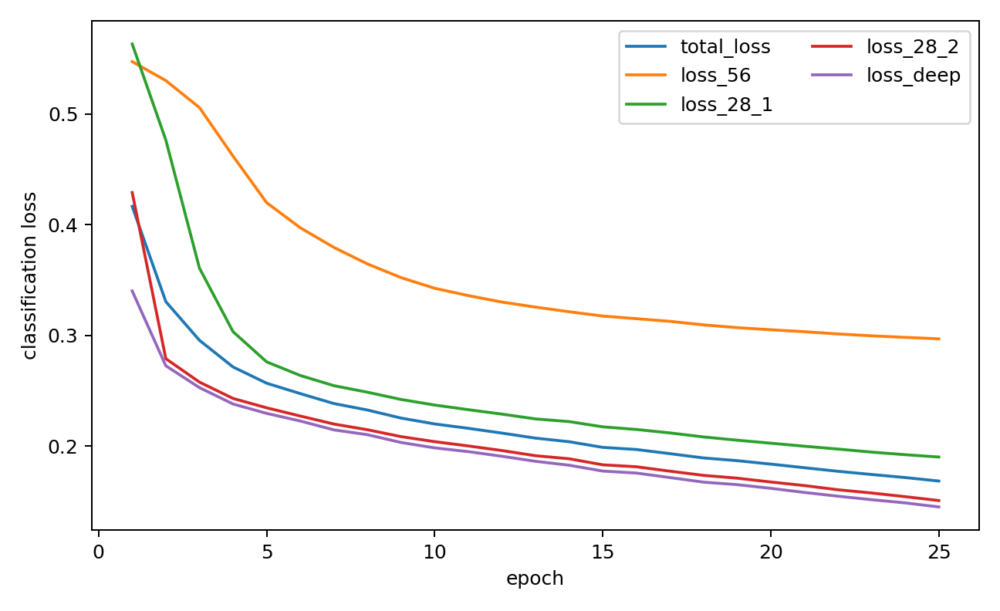
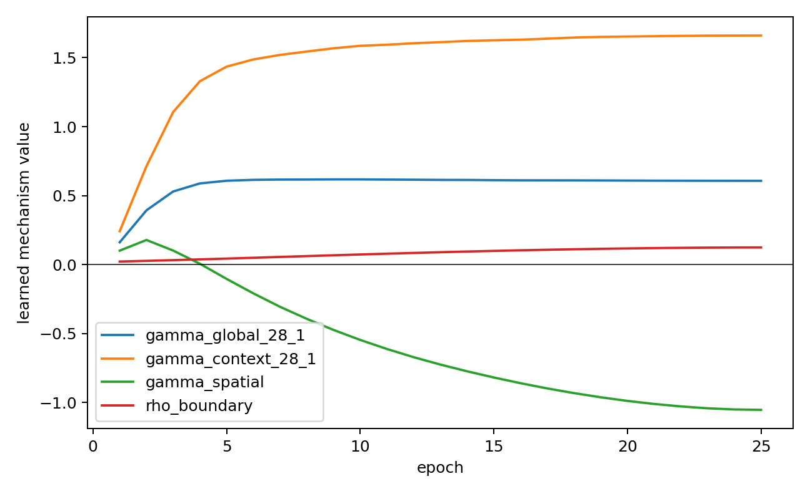

# S²HR-v1 Full Model — BCSS Seed42 Final Report

## 1. Experimental control

- Base: frozen official SSHR A0 `4e9a2887b220d17e27649d72a3d13f32b7ebe8f9`.
- S²HR source commit: `5740a434ea15c5de010991180b3e919a31ee99cc`.
- Only HFRM28_1 is reconstructed; HFRM56/HFRM28_2, backbone, heads, loss, optimizer, schedule, augmentation and released inference/metric are unchanged.
- Fresh ImageNet-pretrained start, BCSS, seed42, batch20, 224×224, BF16, 25 epochs.
- Primary checkpoint: epoch25 FINAL; no validation selection, early stop, test, LUAD, ablation or tuning.
- Two earlier launch attempts stopped before their first optimizer step because an external GPU guard left insufficient memory. The reported `retry2` run started fresh after memory was released; no failed-run state or checkpoint was reused.

## 2. Exact commands

```bash
tools/train_s2hr_25ep.py --trainroot /home/duyanhong/reseg-data/raw/BCSS-WSSS/training --weights /home/duyanhong/sshr-reproduction/SSHR/init_weights/ilsvrc-cls_rna-a1_cls1000_ep-0001.params --output-dir /home/duyanhong/experiments/S2HR_V1_FULL_25EP_SEED42_5740a43_retry2 --num-workers 4
```

```bash
tools/eval_s2hr.py --val-root /home/duyanhong/reseg-data/raw/BCSS-WSSS/val --a0-checkpoint /home/duyanhong/sshr-official-25ep-final-retry2-20260815/runs/bcss_seed42/checkpoints/stage1_last.pth --s2hr-checkpoint /home/duyanhong/experiments/S2HR_V1_FULL_25EP_SEED42_5740a43_retry2/checkpoints/epoch25_final.pth --experiment-dir /home/duyanhong/experiments/S2HR_V1_FULL_25EP_SEED42_5740a43_retry2 --num-workers 4
```

## 3. Final validation result

| Model | Epoch | mIoU | mDice | C0 | C1 | C2 | C3 |
|---|---:|---:|---:|---:|---:|---:|---:|
| SSHR A0 seed42 | 25 | 67.3283 | 80.2683 | 76.4494 | 70.5721 | 57.8272 | 64.4646 |
| S²HR-v1 Full | 25 | 67.0500 | 80.0680 | 76.3745 | 70.1144 | 57.7191 | 63.9919 |

- ΔmIoU: **-0.2784 pp**
- ΔmDice: **-0.2003 pp**
- Per-class ΔIoU: C0=-0.0749 pp, C1=-0.4577 pp, C2=-0.1081 pp, C3=-0.4727 pp
- Primary decision: **S2HR_FULLMODEL_NO_CLEAR_GAIN**
- Per-class safety: **NO_CLASS_REGRESSION_OVER_0.50PP**

## 4. Learned mechanism state

| Parameter | Init | Epoch25 |
|---|---:|---:|
| gamma_global_28_1 | 0 | 0.60733849 |
| gamma_context_28_1 | 0 | 1.66030872 |
| gamma_spatial | 0 | -1.05263877 |
| rho_boundary | 0.01798621 | 0.12448688 |

- mean |Pd-Ps|: 0.09619674
- mean boundary fraction: 0.24425780
- mean CH gate(boundary): 0.87563316
- mean CH gate(interior): 1.00000000

## 5. Runtime and resources

- SSHR parameters: 112,709,714
- S²HR parameters: 112,709,716
- New parameters: 2 (0.000002%)
- Mean training seconds/epoch: 111.11
- Training peak CUDA memory: 3.942 GiB
- A0 inference seconds/image: 0.011926
- S²HR inference seconds/image: 0.020919

## 6. Provenance and safety

- A0 checkpoint SHA256: `509c264ec2df3b7dd6628b227d088db48300a2bc101ef3496d34ea6525911579`
- S²HR checkpoint SHA256: `129ad097ad73f9f564d8778baa8e914f92c8200ed90dc1f8763677dffe91b9ac`
- Training config SHA256: `eb808c451814dc5be65c26b47477093361d124d683b74f51dbef9925cd040703`
- Validation contains exactly 3418 BCSS validation images.
- Both checkpoints use this evaluation script and identical TTA, thresholds, class gate, min-max, fusion and released `iouutils.scores()`.
- S²HR uses a first TTA pass only to obtain the same averaged official deep-presence mask required internally; final postprocessing is unchanged.

## 7. Training diagnostics





## 8. Deferred by protocol

No BPS-CH/SPSR ablation, seeds 11/17, LUAD, BCSS test, mechanism follow-up or hyperparameter change was run.

**S2HR_FULLMODEL_NO_CLEAR_GAIN**

STOP.
