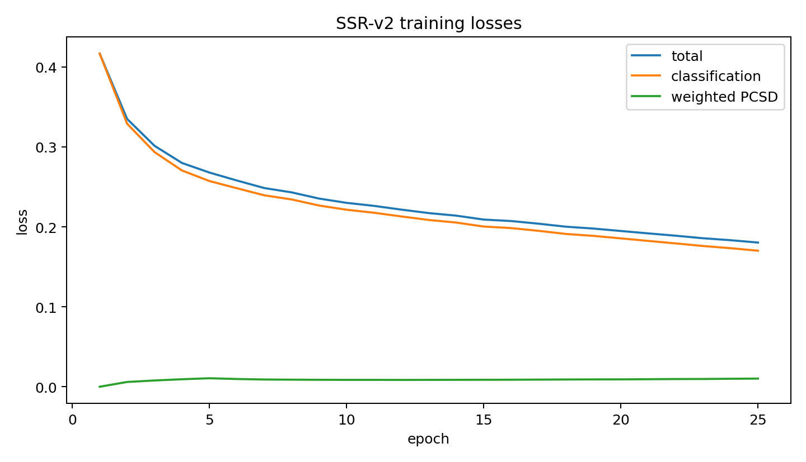
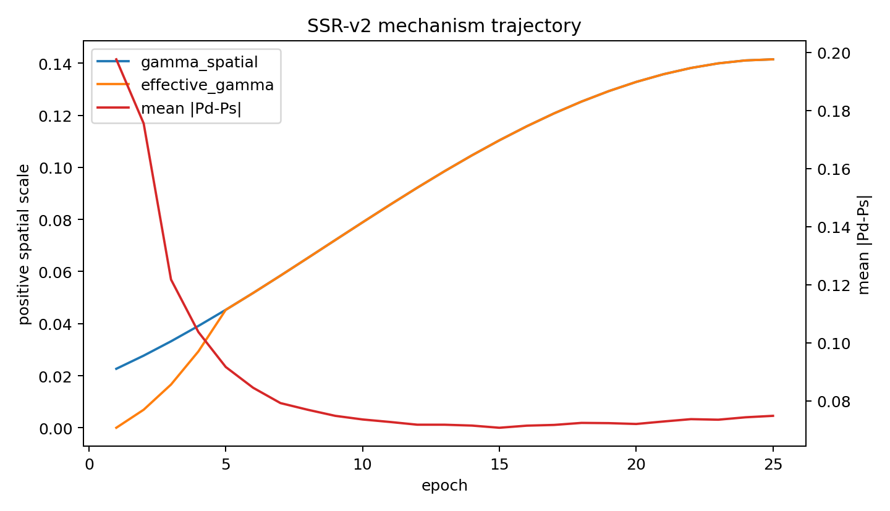

# SSR-v2 Full Model — BCSS Seed42 Epoch25 FINAL

## 1. Executive result

- Decision: **SSRV2_FULLMODEL_NO_CLEAR_GAIN**
- Class safety: **SSRV2_CLASS_REGRESSION_REVIEW**
- ΔmIoU: **-0.4708 pp**
- ΔmDice: **-0.3328 pp**
- Epoch25 FINAL is the only primary checkpoint; no validation selection occurred.

## 2. Frozen experimental control

- Fresh ImageNet-pretrained ResNet38; no trained SSHR/S²HR checkpoint was loaded.
- BCSS seed42, 25 epochs, batch20, 224×224, BF16, base LR 0.01, released PolyOptimizer and augmentation.
- Original HFRM56/HFRM28_2, HFRM28_1 GSR/CH15, CAM heads, loss weights and official inference remain frozen.
- SSR-v2 adds only beta_spatial (+1 scalar), PCSD (λmax=0.05) and positive PTCR with the fixed epoch1–5 ramp.

## 3. Epoch25 validation

| Model | Epoch | mIoU | mDice | C0 | C1 | C2 | C3 |
|---|---:|---:|---:|---:|---:|---:|---:|
| SSHR A0 | 25 | 67.3283 | 80.2683 | 76.4494 | 70.5721 | 57.8272 | 64.4646 |
| SSR-v2 Full | 25 | 66.8575 | 79.9354 | 76.1152 | 70.1353 | 58.0776 | 63.1021 |

| Quantity | Delta (pp) |
|---|---:|
| mIoU | -0.4708 |
| mDice | -0.3328 |
| C0 IoU | -0.3342 |
| C1 IoU | -0.4369 |
| C2 IoU | +0.2504 |
| C3 IoU | -1.3625 |

## 4. Mechanism trajectory

| Quantity | Init | Epoch5 | Epoch10 | Epoch15 | Epoch20 | Epoch25 |
|---|---:|---:|---:|---:|---:|---:|
| gamma_spatial | 0.01814993 | 0.04528903 | 0.07889070 | 0.11039111 | 0.13281068 | 0.14149308 |
| beta_spatial | -4.00000000 | -3.07196045 | -2.49998713 | -2.14802241 | -1.95169044 | -1.88392389 |
| gamma_global | 0.00000000 | 0.56550002 | 0.52758491 | 0.52717417 | 0.53617501 | 0.54078799 |
| gamma_context | 0.00000000 | 1.22494435 | 1.17250311 | 1.16914415 | 1.18404031 | 1.18898201 |
| mean_pcsd_kl | — | 0.21210334 | 0.17210019 | 0.17426508 | 0.18459524 | 0.20401550 |
| mean_abs_pd_minus_ps | — | 0.09161594 | 0.07354472 | 0.07068466 | 0.07198930 | 0.07479153 |

## 5. Validation-only teacher diagnosis

- GT-present deep spatial accuracy: 84.4096%
- GT-present raw CAM28_1 accuracy: 85.0509%
- Deep advantage: -0.6414 pp
- GT masks were applied only after network forward and never entered training or inference decisions.

## 6. Runtime and resources

- SSHR / SSR-v2 parameters: 112,709,714 / 112,709,715
- Added parameters: 1
- Mean seconds/epoch: 109.82
- Peak training CUDA memory: 4.076 GiB
- A0 / SSR-v2 inference seconds per image: 0.011976 / 0.021174

## 7. Provenance

- Training source commit: `04e4631b0c581692ca377501fed45d904bdf34d6`
- Evaluation source commit: `04e4631b0c581692ca377501fed45d904bdf34d6`
- A0 checkpoint SHA256: `509c264ec2df3b7dd6628b227d088db48300a2bc101ef3496d34ea6525911579`
- SSR-v2 checkpoint SHA256: `34265e42164f85dc5a59dcadaf56685bd1c34a89ab71300005dbc6d51c4ea6c3`
- Training config SHA256: `fe9b678eb3d2399534aac8a2c4db991f74e2065dbcec22d02239663236728e74`
- Validation pairs: 3,418; precision BF16; official 3-way TTA, thresholds, class gate, min-max, 0/0.6/0.2/0.2 fusion and released metric.

## 8. Figures

## 9. Stop boundary

No test, LUAD, seeds 11/17, ablation, lambda/gamma/ramp sweep or SSR-v3 was run.

**SSRV2_FULLMODEL_NO_CLEAR_GAIN**

STOP.
